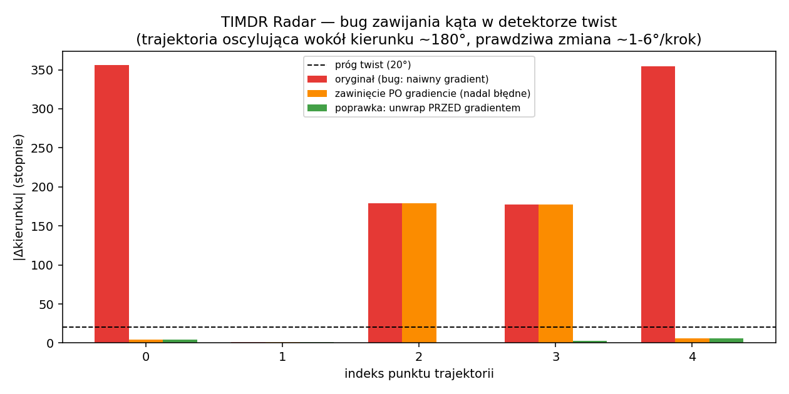

# TIMDR Radar Module

Moduł analizy trajektorii ruchu (`timdr_radar.py`): gradient przepływu
(TIMDR-flow), detekcja topologicznych "twistów" (nagłych zmian kierunku),
redukcja szumu trajektorii (TRM) i prosta predykcja ruchu.

## Status

Kod ze zgłoszenia uruchomiony i przetestowany (`test_timdr_radar.py`,
10/10 testów przechodzi). Znaleziono i naprawiono jeden realny błąd
matematyczny oraz kilka braków w walidacji wejścia.



### 🐛 Błąd: zawijanie kąta w `twist()`

`arctan2` zwraca kierunek ruchu w zakresie `(-π, π]`. Gdy trajektoria
porusza się w kierunku bliskim ±180°, kolejne kąty potrafią przeskakiwać
z ok. `+177°` na ok. `-178°` — fizycznie to zmiana kierunku o ~5°, ale
naiwna różnica liczbowa dwóch kątów daje ~355° (prawie pełny obrót).

Zweryfikowano na trajektorii oscylującej wokół kierunku ~180° z
rzeczywistą zmianą kierunku ~1–6° na krok:

- **oryginalny kod** (`np.gradient(angles)` bez obsługi zawijania):
  zgłaszał różnice kąta ±355°, ±179°, ±177° → **4 fałszywe alarmy
  twist na 5 punktów**, mimo że trajektoria była niemal prostoliniowa.
- **zawinięcie różnicy *po* gradiencie** (`(dtheta+π) % 2π - π`) —
  intuicyjna pierwsza poprawka — **nadal błędne** dla różnic centralnych
  (jakich używa `np.gradient` w punktach wewnętrznych): 2 z 5 punktów
  nadal dawały ~179°.
- **poprawka właściwa**: `np.unwrap()` na całym ciągu kątów *przed*
  różniczkowaniem (dodaje/odejmuje wielokrotności 2π tak, by sąsiednie
  wartości nigdy nie różniły się o więcej niż π) → wszystkie 5 punktów
  daje poprawne różnice ~1–6°, **0 fałszywych alarmów**.

Test regresyjny: `test_zawijanie_kata_nie_daje_falszywego_alarmu`.

### Pozostałe poprawki (walidacja wejścia)

- **`_validate()`**: sprawdza kształt `(N, 3)`, minimalną liczbę punktów
  i to, że znaczniki czasu są ściśle rosnące. Bez tego `dt <= 0`
  (powtórzony lub cofnięty czas) powodował dzielenie przez zero w
  `np.gradient(pos, t, axis=0)` → `inf`/`NaN` propagujące się przez
  wszystkie dalsze obliczenia bez żadnego ostrzeżenia.
- **`timdr_flow()`**: ostatni gradient (`v + a`) teraz też liczony
  względem rzeczywistego czasu `t`, tak jak `v` i `a` — oryginalny kod
  mieszał gradient "po czasie" z gradientem "po indeksie próbki", co
  dawało niespójny wynik przy nierównomiernym próbkowaniu.

## 🎯 Zastosowania (i warunki, przy których mają sens)

Moduł jest ogólnym narzędziem do analizy trajektorii 2D `[x, y, t]` — nie
jest przywiązany do konkretnej dziedziny. Poniżej realistyczne
zastosowania wraz z warunkami, pod którymi wyniki są wiarygodne, i tym,
kiedy metoda przestaje działać.

**1. Śledzenie obiektów w wideo (wizja komputerowa)**
Wejście: pozycja centroidu obiektu z detektora/trackera w kolejnych
klatkach. `twist()` wyłapuje nagłą zmianę kierunku ruchu (np. odbicie
piłki, gwałtowny skręt pojazdu).
*Warunki:* stała lub przynajmniej znana liczba klatek na sekundę (czas
musi być rzeczywisty, nie numer klatki); pozycja musi pochodzić z
wystarczająco stabilnego trackera — szum detekcji (drgająca pozycja
bbox) sam w sobie generuje fałszywe twisty, bo `twist()` nie odróżnia
szumu pomiaru od realnej zmiany kierunku (nie ma w module żadnego filtru
przed detekcją, poza opcjonalnym `trm_reduce()`, którego trzeba użyć
świadomie przed `twist()`).

**2. Śledzenie celu radarowego / sensorowego (dosłowne "radar")**
`predict()` ekstrapoluje pozycję na kilka kroków w przód zakładając
lokalnie stałe przyspieszenie.
*Warunki:* działa sensownie tylko na krótkim horyzoncie i dla celów o
płynnym, mało manewrującym ruchu. Dla celu wykonującego gwałtowne
manewry (np. myśliwiec, nie samolot pasażerski) błąd predykcji rośnie
bardzo szybko, bo model nie ma pojęcia o rzeczywistej dynamice celu —
ekstrapoluje czysto kinematycznie z ostatnich 2-3 próbek.

**3. Analityka sportowa (tor gracza / piłki)**
`twist()` jako wykrywacz zwodów, zmian kierunku biegu, odbić.
*Warunki:* wymaga w miarę regularnego próbkowania (np. z wideo 25-30
fps); przy dużych lukach czasowych (okluzja, gracz poza kadrem)
`_validate()` nie zgłosi błędu dopóki `t` rośnie, ale gradient policzony
przez taką lukę da sztucznie wygładzoną, nierealną prędkość.

**4. Monitorowanie trajektorii robota / drona (2D, np. rzut z góry)**
`twist()` jako sygnał "coś nietypowego się dzieje" (unik przeszkody,
usterka sterowania).
*Warunki:* moduł obsługuje tylko 2D (x, y) — trajektoria 3D (z
wysokością) wymagałaby rozszerzenia, nie da się jej wprost wrzucić do
`[x, y, t]` bez utraty informacji o osi Z. Pozycja powinna być w
jednostkach metrycznych (metry), nie pikselach — inaczej `flow` i
`predict()` mają jednostki bez fizycznego sensu.

**5. Ruch obiektów w danych GPS (ekologia, mobilność ludzi)**
`twist()` jako detektor zmiany zachowania (zwierzę zmienia kierunek
migracji, pieszy zmienia trasę).
*Warunki:* dane GPS mają nierównomierne odstępy czasowe i realny szum
pozycji (rzędu metrów) — przed `twist()` niemal zawsze trzeba użyć
`trm_reduce()` lub innego filtru, inaczej szum GPS sam generuje twisty
częściej niż realne zmiany trasy.

### Ograniczenia wspólne dla wszystkich zastosowań

- **Metoda nie jest przyczynowa (non-causal) dla `twist()` i
  `timdr_flow()`.** `np.gradient()` w punktach wewnętrznych liczy
  różnicę centralną — wykrycie "twistu" w punkcie *i* korzysta też z
  punktu *i+1*, czyli z przyszłości względem *i*. Do zastosowań
  czasu rzeczywistego (strumień na żywo, decyzja natychmiast po nowej
  próbce) nadaje się to z jednopróbkowym opóźnieniem, nie
  bezpośrednio "na bieżąco". `predict()` jest przyczynowy (korzysta
  tylko z przeszłości).
- **`predict()` zakłada lokalnie stałe przyspieszenie.** To ważne
  ograniczenie, nie szczegół — dla celu, który przyspiesza/skręca w
  sposób nieliniowy, błąd rośnie z każdym krokiem predykcji. Nie
  traktować jako predykcję długoterminową.
- **Tylko 2D.** Brak obsługi trzeciego wymiaru (wysokość/głębia).
- **Nazwa "TIMDR" jest tu używana w innym znaczeniu niż w pozostałych
  repozytoriach** (np. w Senscore to filtr statystyczny z-score, w
  probabilistic-timdr to abstrakcyjny akronim topologiczno-brzegowy).
  Tutaj "TIMDR-flow" oznacza po prostu gradient prędkości+przyspieszenia
  trajektorii — warto to doprecyzować, jeśli moduł ma być częścią
  większej, spójnej narracji między repozytoriami.

### Przykład użycia (identyczny jak w zgłoszeniu)

```python
from timdr_radar import TIMDRRadar

radar = TIMDRRadar()
traj = [[0,0,0],[1,0.2,1],[2,0.5,2],[3,1.2,3],[4,2.5,4]]

flow = radar.timdr_flow(traj)
twist = radar.twist(traj)
stable = radar.trm_reduce(traj)
pred = radar.predict(traj)
```

Uruchomienie: `python demo.py` / testy: `pytest -q`.
